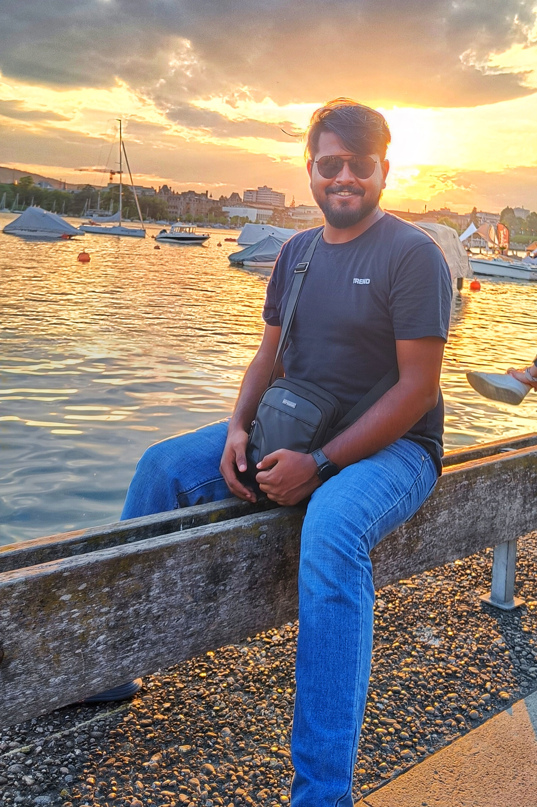

  <a class="active" href="index.html">Home</a>
  <a href="res_pub_conf.html">Research</a>
  <a href="teaching.html">Teaching</a>
  <a href="misc.html">Misc.</a>

 

> 
 
 "I have no special talent. I am only passionately curious." - Albert Einstein 
 

### Hey!

I am currently a Ph.D scholar at the [Department of Physics](https://physics.iitm.ac.in), Indian Institute of Technology (IIT) Madras, Chennai. I work with [Prof. L. Sriramkumar]([https://physics.iitm.ac.in/~sriram/index.html]). My interests are in the area of *cosmological inflation* and *data analysis of Cosmic Microwave Background*. I am also quite interested in learning about applications of *machine learning* in physics simulations.

I currently stay on campus at IIT Madras in Pampa Hostel, while my native place is back in the town of [Ranaghat]([https://en.wikipedia.org/wiki/Ranaghat]), West Bengal. Apart from my academic interests, I am passionate about programming and photography (check out my [<i class="fa fa-instagram fa-lg"></i>]). I loved to watch football, and I believe football is the greatest sports in the world.

### Academics

| Year | Details |
| --- | --- |
| 2020 - now | M.Sc (2020-2022) & Ph.D. (2022-now) in Physics, IIT Madras.  |
| 2017 - 2020 | B.Sc with Physics (Hons.), Ramakrishna Mission Residential college, Narendrapur. |

> 
 
 My CV is available <a href="https://drive.google.com/file/d/1pDmqyZtTw7QiOCLzVDtpZioT9_SFtdWR/view?usp=sharing)">here</a>.

### You can find me at ...

<iframe src="https://www.google.com/maps/place/Department+Of+Physics,+Indian+Institute+Of+Technology+Madras/@12.9889372,80.2322199,15z/data=!4m2!3m1!1s0x0:0x72ac64139aeaf118?sa=X&ved=2ahUKEwjwvMz06ImEAxX3SGwGHYUSBroQ_BJ6BAhcEAA" width="200" height="175" style="float: right; border:0; padding-left: 10px; padding-bottom: 5px;" allowfullscreen="" loading="lazy"></iframe>

<link rel="stylesheet" href="https://cdnjs.cloudflare.com/ajax/libs/font-awesome/4.7.0/css/font-awesome.min.css">

***Links.*** [<i class="fa fa-google fa-lg"></i>-scholar], [<i class="fa fa-git fa-lg"></i>hub], [Linked<i class="fa fa-linkedin fa-lg"></i>] and [<i class="fa fa-facebook-f fa-lg"></i>acebook].

***Email IDs.*** alipriyo12 [at] [gmail.com (personal email); ph20d203 [at] smail.iitm.ac.in / alipriyo [at] physics.iitm.ac.in (IITM - work emails)].

***Office Address.*** HSB 202, Department of physics, Indian Institute of Technology Madras, Chennai 600036.

[<i class="fa fa-google fa-lg"></i>-scholar]: https://scholar.google.com/citations?hl=en&view_op=list_works&alert_preview_top_rm=2&authuser=2&gmla=AJsN-F6rWGoE7sGF-2nr8CLDhXm_38Ftp_fxX0X6ieV4zVOmsXvQaDZkf6P2HSbFReOJ4TNweS9QakTMbQz0h0yQ-0dhqCcDUmkL28jKTIbk-G91L3hjPyE&user=2OR7h7kAAAAJ

[<i class="fa fa-git fa-lg"></i>hub]: https://github.com/dhrubajyoti98

[Linked<i class="fa fa-linkedin fa-lg"></i>]: https://www.linkedin.com/in/dhrubajyoti-biswas/

[<i class="fa fa-instagram fa-lg"></i>]: https://www.instagram.com/alarte__ascendare/?next=%2F

[<i class="fa fa-youtube fa-lg"></i>]: https://www.youtube.com/c/DhrubajyotiBiswas2k14

[<i class="fa fa-facebook-f fa-lg"></i>acebook]: https://www.facebook.com/alipriyo.hoory
